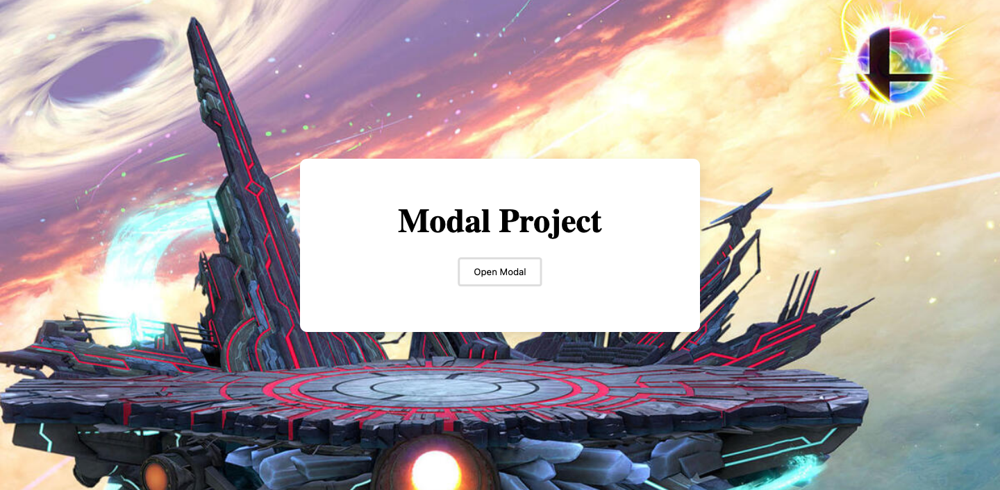

## Modal Box with CSS and JavaScript
A modal is a dialog box/popup window that is displayed on center of the current page.

I learned from [freecodecamp](https://www.freecodecamp.org/news/javascript-projects-for-beginners/#how-to-create-a-modal) how to create a modal window which is used on websites to get users to do or see something specific.
## Screenshot

## Key concepts covered:
- document.querySelector()
- addEventListener()
- classList.add()
- classList.remove()

